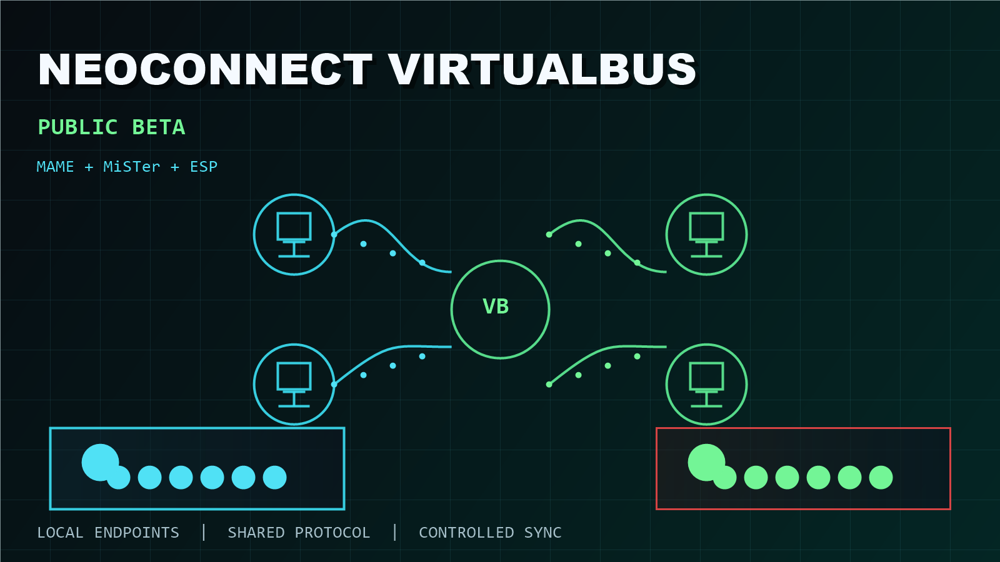
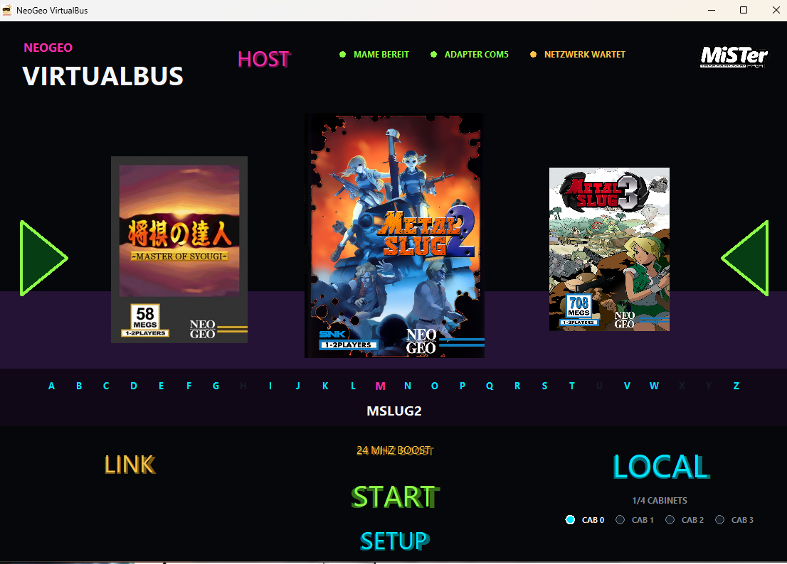
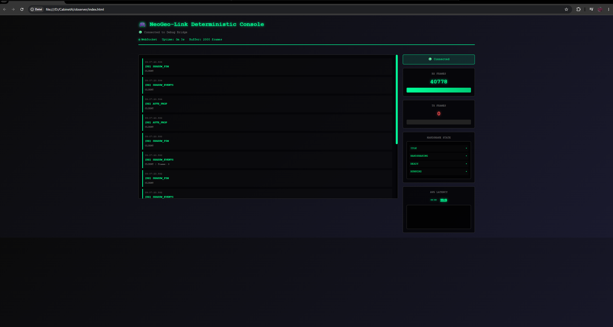
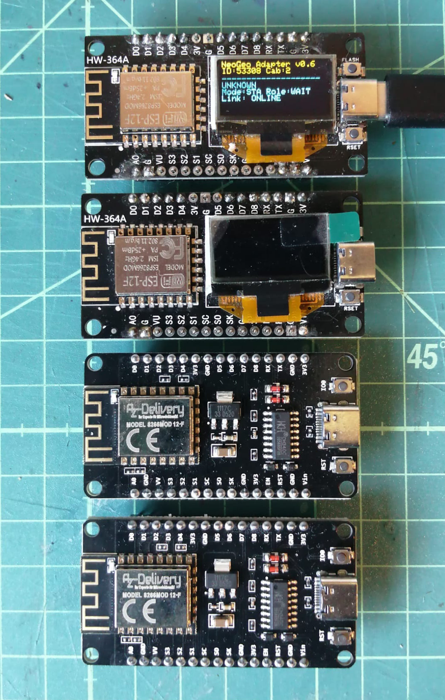

**Live demonstration:** [League Bowling, 8-player](https://www.youtube.com/watch?v=72LlkCf3ksc)

# NeoConnect VirtualBus

> **Public project preview / controlled beta testing in progress.**
>
> Binary packages are currently provided only to selected testers through
> private links or prepared USB media. There is no public binary download yet.

## What is this?

NeoConnect VirtualBus connects multiple Neo Geo instances across MAME,
MiSTer and dedicated ESP adapters. It provides cabinet identity, session
roles, transport-independent framing, game-specific MCU profiles,
InputSync diagnostics and controlled reconnect behavior.

### User launcher



### Diagnostics



## Controlled beta status

The current public-beta candidate is `0.9.0-beta.6`. Its MAME-to-MAME
InputSync authority is the focused package binary:

```text
MAME/neogeo.exe
SHA256 F05C1BAEA1BAD9826F55856F2D4DBB7D32D40C0501BC550CAB0FC0F178A8398A
```

This binary is the retained smooth LKG for the first public beta candidate. A
newer local `neogeo.exe` is not a release replacement unless it passes the
same A/B InputSync acceptance and the package checksums are regenerated.

beta.6 adds deterministic MAME InputSync v3 startup, canonical preflight,
Coin/System input authority and fail-closed sync-loss behavior. MiSTer
InputSync v3 artifacts exist as a matched candidate set, but mixed
MAME-to-MiSTer InputSync parity must still be listed as pending until physical
acceptance passes.

No download is intentionally attached to this repository yet. The first
public GitHub Release will contain one immutable user package, its SHA256
checksum, release notes and the corresponding source/license material required
for every redistributed GPL component.

See [Beta Scope](BETA_SCOPE.md) for the exact supported boundary and
[Release Process](docs/RELEASE_PROCESS.md) for the publication gates.

The controlled test group is validating the real external-user path: package
verification, ESP flashing, cabinet configuration, MAME/MiSTer installation,
session startup and useful failure logs. Test packages remain versioned and
must not be mixed even during this closed phase.

## Tested VirtualBus?

Open a [beta test report](https://github.com/Macdaxter/NeoConnect-VirtualBus/issues/new?template=beta_test_report.yml)
and briefly describe your setup, what worked and what did not. No testing
resume, mandatory logs or laboratory procedure is required. Play first and
report what you observe.

Diagnostics are disabled by default. If something fails, they can be enabled
explicitly in the launcher and shared voluntarily after redaction. Never post
credentials, private IP addresses, ROM information or personal data in a
public issue. Until the first public binary release, versioned test packages
continue to be distributed through the controlled test group.

## Proven reference paths

- MAME to MAME for the documented LKG profiles.
- MAME to MiSTer for documented MCU profiles at original timing.
- Riding Hero and League Bowling reference topologies.
- Thrash Rally M58 protocol and membership path, with a documented initiator
  timing limit.
- MAME InputSync v3 for documented MAME-to-MAME profiles, including canonical
  preflight, F1/F5 transport, F3 diagnostics and Coin/System input authority.
- NodeMCU USB and local WLAN/LAN transports.
- Timeout, peer-loss, reconnect and portable launcher diagnostics.
- MiSTer Original/Fixed16/Fixed24 local clock profiles.

## Hardware reference

The current beta reference uses ESP8266 NodeMCU adapters, with display and
no-display variants supported by the packaged firmware.

<p align="center">
  
</p>

## Package model

Git tracks public documentation and release metadata. Compiled packages are
published only as immutable GitHub Release assets:

```text
VirtualBus-<version>-User_USB_Portable.zip
VirtualBus-<version>-Corresponding_Source.zip
SHA256SUMS.txt
```

The internal Developer Reference, complete logs, historical LKGs and research
snapshots are archived separately and are not public release assets.

## Important limits

- No ROM, BIOS or CHD data is included or provided.
- NodeMCU RS485 is protocol-validated but not release-qualified for continuous
  real-time InputSync.
- ESP32 HardwareSerial/MAX485 remains a separate hardware qualification block.
- Public relay, lobby, accounts and NAT traversal are outside the current beta.
- MiSTer InputSync v3 and mixed-clock MAME/MiSTer InputSync are not public PASS
  claims until the exact package artifacts pass physical acceptance.

## Start here

1. Read [Beta Scope](BETA_SCOPE.md).
2. Read [Installation](INSTALL.md).
3. Review the [Protocol Overview](PROTOCOL_OVERVIEW.md).
4. Keep MAME, MiSTer, frontend and ESP components from one release together.

VirtualBus follows the principles in the [Project Charter](PROJECT_CHARTER.md):
local operation, self-hosting, transparent diagnostics, voluntary telemetry
and preservation are part of the system contract.

AI accelerated the implementation, but it did not define the project. I designed the system, chose the experiments, interpreted the results and made the architectural decisions. AI effectively gave me a virtual development team, allowing me to implement and test ideas at roughly the speed I could reason about them.
